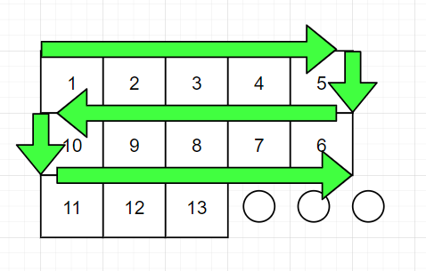

This is a small project I made using a Ardunio UNO, an IR Sensor and a chopped up WS2812B 5v addressable LED light strip.

The led pattern follows a Boustrophedon wiring pattern because I didn't want to mess with long wires, next time I do the long wires.

If you don't know what that is here is a simple example.

Because of this pattern I had to code around the matrix in the ControllerSetup.h in the up / down / left /right functions. Right now you can use a remote to 
* Enter / exit edit mode
* Move edit cursor around up / down / left / right
* Choose 9 differnet colors (1-9), 0 being Black for off
* Press some button as a select to solidify you choice of color

Let me know if you see a better way to g